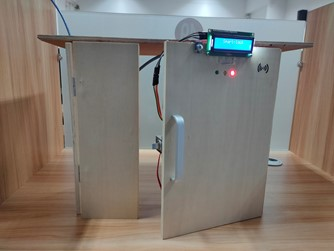

# 智能门锁 说明文档

## 创作灵感
&nbsp; &nbsp; &nbsp; &nbsp;新冠肺炎疫情发生以来，习近平总书记高度重视，多次主持召开会议对疫情防控工作进行研究部署，并对如何发挥社区在疫情防控中的作用提出明确要求。习近平总书记指出，要压实地方党委和政府责任，强化社区防控网格化管理，实施地毯式排查，采取更加严格、更有针对性、更加管用有效的措施，防止疫情蔓延。

&nbsp; &nbsp; &nbsp; &nbsp;本人以社区和家庭疫情防控为出发点，设计了一款智慧防疫门禁系统。本次设计的作品能够实现刷卡，蓝牙开锁等方式开启家庭门锁，同时实时监测人的体温，贴心的提示外出回家的人员消毒。防止体温过热人员回家接触家人，造成病情蔓延。

&nbsp; &nbsp; &nbsp; &nbsp;这样一个可以让人们在享受智慧家居便利性的同时，又能监测健康状况的智慧防疫门禁系统，能够很好地配合社区疫情防控，做好家庭防疫工作。

## 设计思路
&nbsp; &nbsp; &nbsp; &nbsp;这是一种无接触式的门锁，自然就要用到现在成熟的无线技术了。在这种小型门锁中，蓝牙技术再好不过了。再利用`RFID-RC522`模块，也能实现NFC通信。
&nbsp; &nbsp; &nbsp; &nbsp;疫情期间，大家对自己的健康也有极大的要求。家庭门锁也要实时监控自己的体温以及客人的体温。如果你的体温超过37.3摄氏度，那智能门锁也会利用LED灯以及蜂鸣器来警告你，同时也会紧闭门锁，做好疫情防控第一步。
##### &nbsp; &nbsp; &nbsp; &nbsp;直观的设计思路以及功能原理图如图1所示：

图1 设计思路及功能原理图

## 团队成员
1. 成员：杨承润 八年级
2. 指导老师：黄罗华 中学教师

## 硬件一览
> 主控板：
> 
> Arduino Mega 2560 *1
> 
> 配件：
> 
> RFID-RC522模块 *1
> 
> DX-BT05蓝牙模块 *1
> 
> FL-3FF-S-Z继电器模块 *1
> 
> 蜂鸣器 *1
>
> 电磁锁 *1
> 
> LED *3
> 
> 220Ω电阻 *3

## 接线图
| 模块名称  |模块针脚|Aruduino Mega针脚|
|  :--:    |  :--:  |      :--:      |
|Relay Mode|   VCC  |       5V       |
|Relay Mode|   GND  |      GND       |
|Relay Mode|   IN   |       D5       |
|RFID-RC522|   IRQ  |      D10       |
|RFID-RC522|   SCK  |       D8       |
|RFID-RC522|  MOSI  |       D9       |
|RFID-RC522|  MISO  |      D11       |
|RFID-RC522|   SDA  |       D7       |
|RFID-RC522|   RST  |      D12       |
|RFID-RC522|  3.3V  |     3.3V       |
|RFID-RC522|   GND  |      GND       |
|  Buzzer  |   GND  |      GND       |
|  Buzzer  |   VCC  |       5V       |
|  Buzzer  |   I/O  |       D2       |
|  DX-BT05 |   GND  |      GND       |
|  DX-BT05 |   VCC  |       5V       |
|  DX-BT05 |    TX  |       RX       |
|  DX-BT05 |    RX  |       TX       |
|  DX-BT05 |    EN  |       5V       |
| mlx90614 |   GND  |      GND       |
| mlx90614 |   VCC  |      VCC       |
| mlx90614 |   SDA  |      SDA       |
| mlx90614 |   SCL  |      SCL       |
| LED-Red  |   GND  |      GND       |
| LED-Red  |   VCC  |   220Ω电阻端    |
|LED-Yellow|   GND  |      GND       |
|LED-Yellow|   VCC  |   220Ω电阻端    |
|LED-Green |   GND  |      GND       |
|LED-Green |   VCC  |   220Ω电阻端    |
| 220Ω电阻 |   一端  |       5V       |
| 220Ω电阻 |  另一端 |      LED       |
---
##### 仿真接线图如下

图2 仿真接线图

## 制作过程

1. 准备木板，设计家庭木门外观：
    - 使用切割机切割木板，得到前门和侧门
    - 在前门中间安装电磁锁

1. 门板正面外观和组装设计：
    - 使用电钻钻出三个LED发光二极管
    - 在门板上沿安装红外温度检测模块
    - 在门板上沿安装LCD液晶显示屏
    - 在门板右上角画门禁图案

3. 门板背面外观和组装设计
    - 安装电池盒和继电器开关
    - 安装Arduino电路板
    - 安装门禁卡

4. 组装木板以及组接各个模块
    - 将木板前门和侧边墙壁组装
    - 接线并通电

5. 测试各个模块功能以及两种开锁方式
    - IC门禁卡开锁
    - 手机蓝牙开锁

## 成品外观

图3 成品外观正面

图4 成品外观侧面

图5 成品外观背面

图6 成品外观俯视图

## 使用说明
&nbsp; &nbsp; &nbsp; &nbsp;这个家庭智能门锁提供多种开锁方式，你可以使用IC卡或者手机蓝牙打开他它。
 
&nbsp; &nbsp; &nbsp; &nbsp;门锁上有三个LED灯，若红灯常亮即为待机状态;绿灯亮起，蜂鸣器鸣叫两声，表示锁已打开;黄灯闪烁两次，蜂鸣器鸣叫三声，表示体温过高;红绿黄三灯亮起，蜂鸣器长鸣，即表示密码错误。

&nbsp; &nbsp; &nbsp; &nbsp;当你想要使用IC卡进行开锁操作，仅需将正确的IC卡放置到读卡区域，IC卡读到后，将会自动打开。使用蓝牙开锁时，仅需连接上`Smart-lock`蓝牙，通过串口发送密码，即可打开门锁。
